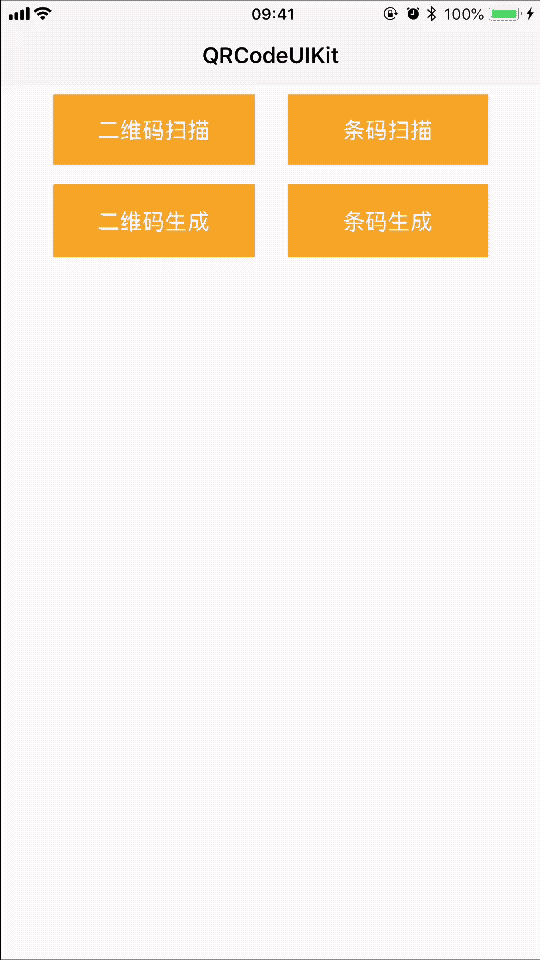

[](https://travis-ci.org/pcjbird/QRCodeUIKit)
[](http://cocoadocs.org/docsets/QRCodeUIKit/)
[](http://cocoadocs.org/docsets/QRCodeUIKit/)
[](https://www.apache.org/licenses/LICENSE-2.0.html)
[](https://github.com/pcjbird/QRCodeUIKit/releases)
[](https://github.com/pcjbird/QRCodeUIKit/releases)
[](https://pcjbird.github.io)

# QRCodeUIKit
一款让扫码变得简单的视图控制器。
    
    
## 演示 / Demo

<p align="center"></p>
    
    
##  安装 / Installation

方法一：`QRCodeUIKit` is available through CocoaPods. To install it, simply add the following line to your Podfile:

```
pod 'QRCodeUIKit'
```
    
    
## 使用 / Usage   
```
#import <QRCodeUIKit/QRCodeUIKit.h>
     
- (IBAction)OnQRCodeScan:(id)sender {
     QuickQRCodeScanController *scanVC = [QuickQRCodeScanController new];
     [self.navigationController pushViewController:scanVC animated:YES];
}
     
- (IBAction)OnBarCodeScan:(id)sender {
     QuickBarCodeScanController *scanVC = [QuickBarCodeScanController new];
     [self.navigationController pushViewController:scanVC animated:YES];
}
     
- (IBAction)OnGenQRCode:(id)sender {
     UIImage* logo = [[UIImage imageNamed:@"AppIcon60x60"] yy_imageByRoundCornerRadius:8.0f];
     self.qrcode.image = [QuickQRCodeGenerator generateQRCode:@"我是一个二维码" width:CGRectGetWidth(self.qrcode.frame) height:CGRectGetHeight(self.qrcode.frame) logo:logo logoSize:CGSizeMake(60, 60)];
     self.qrcodeback.hidden = NO;
}
     
- (IBAction)OnGenBarCode:(id)sender {
     NSString* code = @"8986011684013010860";
     self.barcodeLabel.text = [QuickBarCodeGenerator formatCode:code];
     self.barcode.image = [QuickBarCodeGenerator generateBarCode:code width:CGRectGetWidth(self.barcode.frame) height:CGRectGetHeight(self.barcode.frame)];
}
```
    
    
## 关注我们 / Follow us
  
<a href="https://itunes.apple.com/cn/app/iclock-一款满足-挑剔-的翻页时钟与任务闹钟/id1128196970?pt=117947806&ct=com.github.pcjbird.QRCodeUIKit&mt=8"></a>

[](https://twitter.com/intent/tweet?text=https://github.com/pcjbird/QRCodeUIKit)
[](https://twitter.com/pcjbird)
